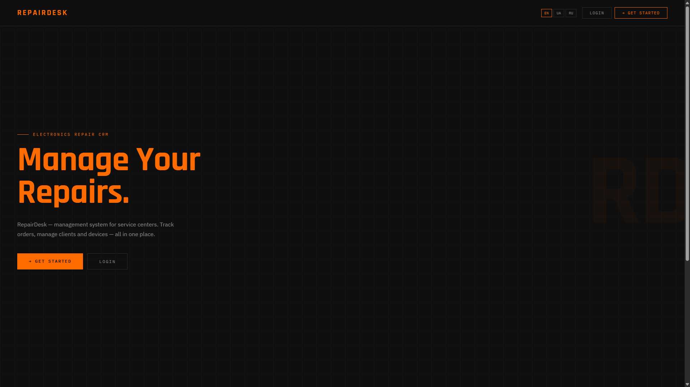
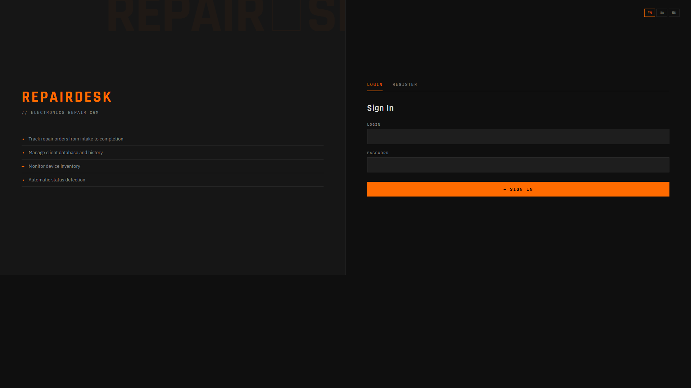
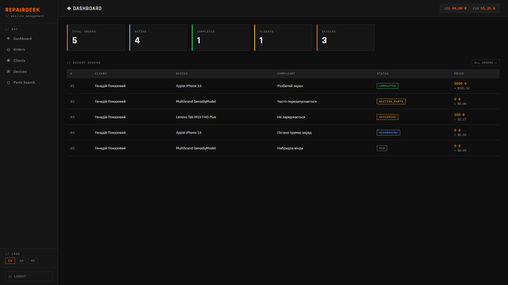
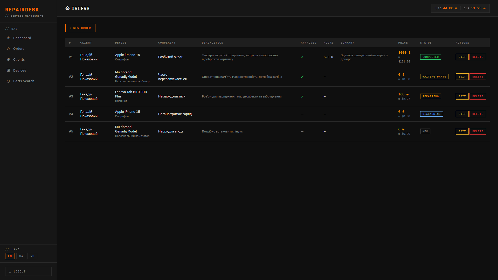
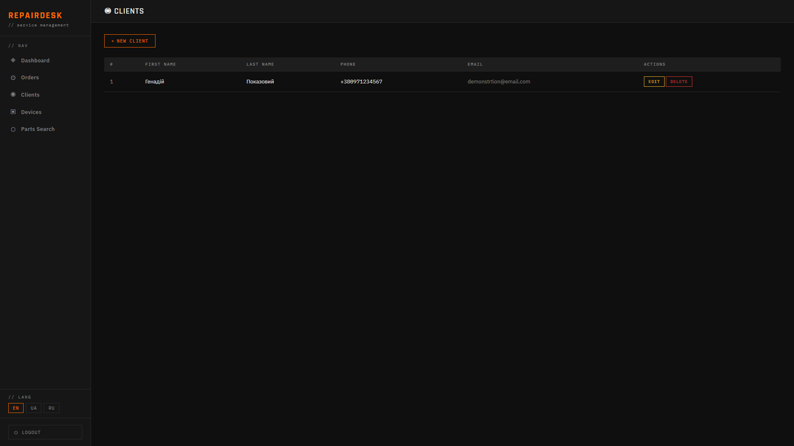
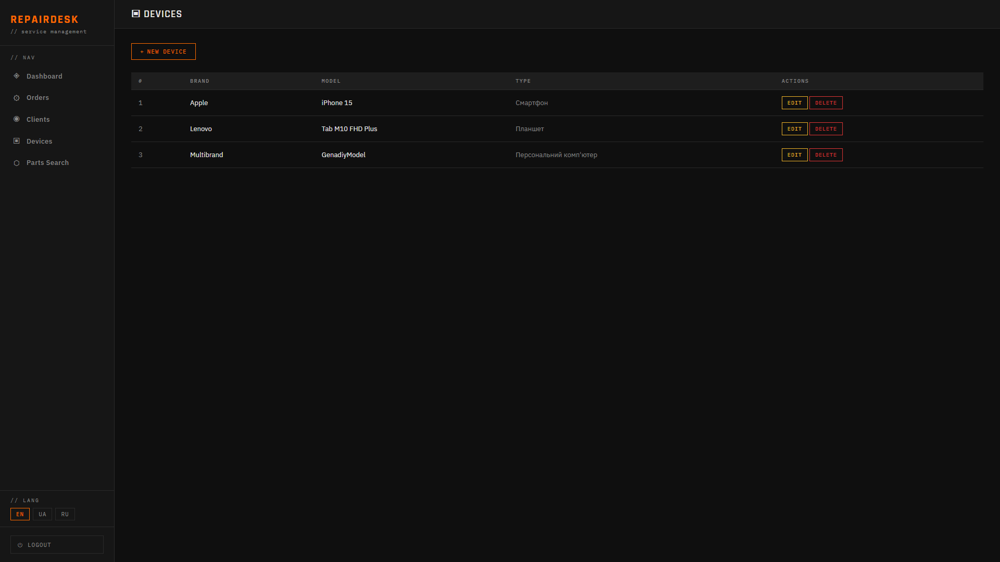
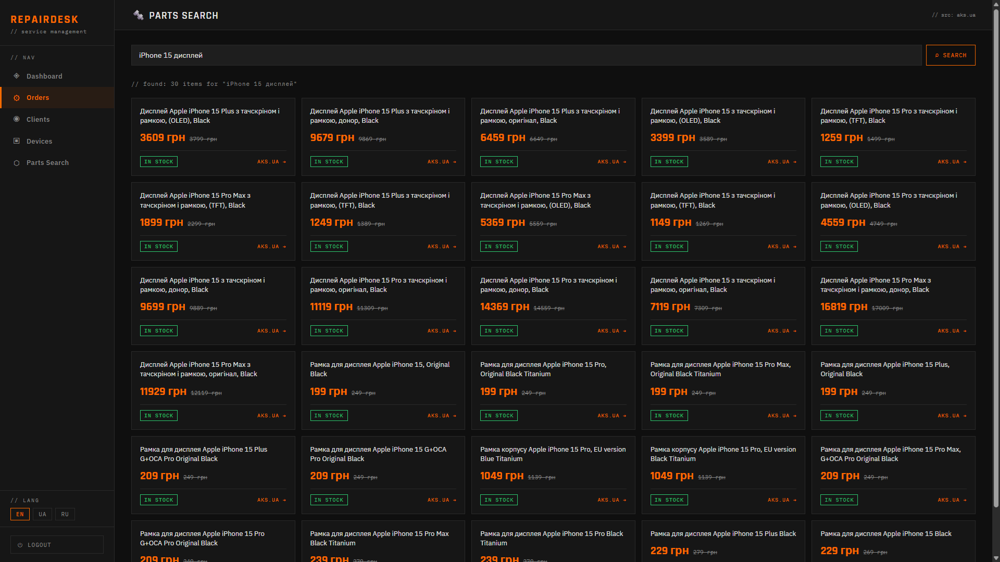

# RepairDesk


**RepairDesk** is a web application for managing electronics repair orders.
It helps service engineers manage their customer database, device catalog, and repair orders in a single interface.

---

## 🌐 Demo

**https://repairdesk-production-160c.up.railway.app/**

login: demo
password: demo

---

## 📸 Screenshots
| Welcome |
|-------|
|  |

| Login | Dashboard |
|-----------|-------|
|  |  |

| Orders | Clients |
|-----------|---------|
|  |  |

| Devices | Parts Search | |
|--------|-------------|--|
|  |  | |

---

## ✨ Features

- **Authentication** — registration and authorization via Spring Security with BCrypt
- **Clients** — creating, editing, and deleting a client database
- **Devices** — cataloging equipment by brand, model, and type
- **Orders** — full repair cycle: diagnostics, approval, cost, status
- **Dashboard** — summary statistics with recent orders
- **Exchange Rate** — current USD/EUR exchange rate from PrivatBank API, updated automatically
- **Dual Currency** — order prices are displayed in both hryvnia and dollars
- **Parts Search** — parsing current prices and availability from [aks.ua](https://www.aks.ua) (Jsoup)
- **Multilingual** — interface in Ukrainian, Russian, and English (i18n, cookies)
---

## 🛠 Tech Stack

### Backend
| Technology | Version | Description |
|-----------|----------|
| Java | 21 | Primary Language |
| Spring Boot | 4.0.3 | Application Framework |
| Spring MVC | — | HTTP Request Handling |
| Spring Security | 7.x | Authentication and Authorization |
| Spring Data JPA | — | Database Access |
| Hibernate | — | ORM |
| Jsoup | 1.17.2 | HTML Parsing (aks.ua) |
| Lombok | — | Boilerplate Code Reduction |
| Jackson | 3.x | JSON Serialization |

### Frontend
| Technology | Description |
|-----------|----------|
| Thymeleaf 3.1 | Server-side templating engine |
| HTML5 / CSS3 | Layout |
| IBM Plex Sans / Mono | Primary typography |
| Rajdhani | Headings and numbers |

### Database & Tools
| Tool | Description |
|-----------|----------|
| H2 Database | Embedded in-memory database |
| Maven | Project build |

---

## 🏗 Architecture

Spring Boot's classic three-layer architecture:

```
HTTP Request
     ↓
Controller  (ViewController, AuthController)
     ↓
Service     (ClientService, DeviceService, RepairOrderService,
             ExchangeRateService, AksParserService ...)
     ↓
Repository  (JpaRepository)
     ↓
H2 Database
```

### Project structure

```
src/main/java/com/Vlad/RepairDesk/
├── config/
│   ├── SecurityConfig.java          # Spring Security
│   └── LocaleConfig.java            # i18n + CookieLocaleResolver
├── controller/
│   ├── ViewController.java          # dashboard, clients, orders, parts...
│   └── AuthController.java          # registration / login
├── service/
│   ├── ClientService.java
│   ├── DeviceService.java
│   ├── RepairOrderService.java
│   ├── CurrentUserService.java
│   ├── ExchangeRateService.java     # PrivatBank API
│   └── AksParserService.java        # parsing aks.ua
├── repository/
│   ├── ClientRepository.java
│   ├── DeviceRepository.java
│   └── RepairOrderRepository.java
├── model/
│   ├── User.java
│   ├── Client.java
│   ├── Device.java
│   └── RepairOrder.java
└── dto/
    ├── RepairOrderRequestDTO.java
    ├── RepairOrderResponseDTO.java
    └── AksProductDTO.java

src/main/resources/
├── templates/
│   ├── layout.html                  # basic layout with sidebar
│   ├── dashboard.html
│   ├── clients.html
│   ├── devices.html
│   ├── orders.html
│   ├── parts_search.html            # search for spare parts
│   ├── login.html
│   ├── index.html
│   └── create_*/edit_* ...
├── messages.properties              # English
├── messages_uk.properties           # Українська
├── messages_ru.properties           # Русский
└── application.properties
```

---

## 🚀 Getting Started

### 1. Clone the repository

```bash
git clone https://github.com/username/RepairDesk.git
cd RepairDesk
```

### 2. Launch the application

```bash
mvn spring-boot:run
```

The application will launch on **http://localhost:8080**

### 3. Register

Go to `/login`, switch to the **Register** tab and create an account.

---

## 🗄 Database

The built-in **H2 in-memory** database is used—no installation required.

The console is available at:**http://localhost:8080/h2-console**

```
JDBC URL:  jdbc:h2:mem:repairdesk
User:      sa
Password:  (empty)
```

> ⚠️ Data is lost upon reboot. For permanent storage, replace the H2.

---

## 🔌 External Integrations

### PrivatBank API — Exchange Rates
Automatically pulls the current USD/EUR exchange rate to the dashboard and order page.
```
GET https://api.privatbank.ua/p24api/pubinfo?exchange&coursid=5
```
If the API is unavailable, fallback values ​​are used and the application does not crash..

### aks.ua — Spare parts parsing (Jsoup)
The spare parts search page parses the name, price (current and previous), and availability status of the product in real time.
```
GET https://www.aks.ua/uk/search?for={query}
```

---

## 🔒 Security

- All pages are protected - unauthorized users are redirected to /login
- Passwords are hashed using BCrypt
- Each user sees only their own data (multi-tenant via user_id)
- CSRF protection is enabled (disabled for H2 Console in dev mode)

---

## 🌍 Internationalization

The interface language is saved in a cookie and can be changed with one click directly in the sidebar.

| Код | Язык |
|-----|------|
| `en` | English |
| `uk` | Українська |
| `ru` | Русский |

---

## 📦 Deployment

```bash
# Building an executable JAR
mvn clean package -DskipTests

# Launch
java -jar target/RepairDesk-0.0.1-SNAPSHOT.jar
```

Supported platforms: **Railway**, **Render**, **VPS**, **Docker**

---

## 🗺 Roadmap

- [ ] User roles (admin / technician)
- [ ] Search and filter by clients and orders
- [ ] Export orders to PDF / Excel
- [ ] Email notifications about repair status changes
- [ ] Order change history
- [ ] PostgreSQL for production deployment

---

## 👤 Author

**Vlad Saienko** — Electronics repair technician & Java developer

---

## 📄 License

This project is licensed under the [MIT License](LICENSE).
